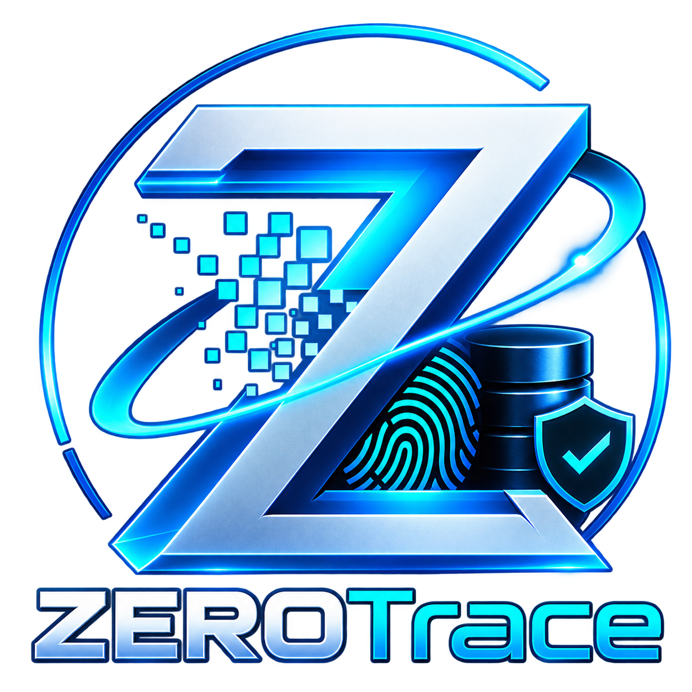

<div align="center">



# ZeroTrace®

### **Integrated Defense-Grade Data Sanitization & Forensic File Recovery Platform**
*National Forensic & Cybersecurity Platform — NTRO SIH26149*

<p align="center">
  <a href="https://github.com/MK-codes365/zerotrace/stargazers"></a>
  <a href="https://github.com/MK-codes365/zerotrace/network/members"></a>
  <a href="https://github.com/MK-codes365/zerotrace/issues"></a>
  <a href="https://github.com/MK-codes365/zerotrace/blob/main/LICENSE"></a>
</p>

<p align="center">
  
  
  
  
  
  
  
</p>

[🌐 Live Web Platform](#-web-dashboard) • [💻 Desktop Application](#-windows-desktop-tool) • [🛡️ Cryptographic Engine](#-core-algorithms) • [⚡ Quickstart](#-quickstart)

---

</div>

## 🌟 Executive Overview

**ZeroTrace®** unifies irreversible media erasure and forensic-grade data recovery into a single tamper-evident ecosystem. Engineered for defense agencies, law enforcement digital forensic units, and enterprise cybersecurity operations.

```
┌────────────────────────────────────────────────────────────────────────┐
│                        ZeroTrace® Ecosystem                            │
├───────────────────────────────────┬────────────────────────────────────┤
│   🛡️ Military-Grade Sanitization  │    🔍 Forensic File Recovery       │
│   • NIST SP 800-88 Clear & Purge  │    • Scalpel Signature Carving     │
│   • DoD 5220.22-M (3/7-Pass)      │    • Bi-Directional Fragment Graph │
│   • Peter Gutmann (35-Pass)       │    • Structural Consensus Scoring  │
├───────────────────────────────────┴────────────────────────────────────┤
│   ⛓️ Cryptographic Ledger: Merkle Tree Roots + SHA-256 Hash Chains     │
└────────────────────────────────────────────────────────────────────────┘
```

---

## ⚡ Core Algorithmic Architecture

| 🔮 Algorithm / Engine | 🎯 Operational Purpose | 📍 Code Implementation |
| :--- | :--- | :--- |
| **⚙️ Master–Worker** | Parallel sector overwriting & multi-threaded carving | [`windows_tool/engines/nwipe_engine.py`](windows_tool/engines/nwipe_engine.py) |
| **🗺️ MapReduce** | Splits multi-GB disk streams into chunks with overlap windows | [`windows_tool/engines/scalpel_carver.py`](windows_tool/engines/scalpel_carver.py) |
| **🎯 Consensus Scoring** | Evaluates header, footer, chunk syntax & entropy | [`windows_tool/engines/structure_validator.py`](windows_tool/engines/structure_validator.py) |
| **🕸️ Fragment Graph** | Reconstructs non-contiguous clusters across disk gaps | [`windows_tool/engines/scalpel_carver.py`](windows_tool/engines/scalpel_carver.py) |
| **🌲 Merkle Tree** | $O(\log N)$ block integrity proofs for digital certificates | [`windows_tool/core/crypto.py`](windows_tool/core/crypto.py) |
| **⛓️ Hash Chain** | Tamper-evident chronological custody ledger | [`windows_tool/core/audit.py`](windows_tool/core/audit.py) |

---

## 💻 ZeroTrace Desktop Tool

<details open>
<summary><b>🛠️ Desktop Capabilities & Features</b></summary>
<br>

* 🔌 **Low-Level Sector I/O**: Direct Windows raw disk handle access (`\\.\PhysicalDriveX`).
* 🧹 **Certified Sanitizer**: Automated pattern overwriting with zero residual magnetization checks.
* 🔎 **Scalpel Engine**: Deep file carving across raw images (`.E01`, `.DD`, `.RAW`) and damaged drives.
* 📜 **Signed Certificates**: Instant PDF compliance certificates with SHA-256 hashes and QR verification.

```powershell
# Run ZeroTrace Desktop App
cd windows_tool
python -m venv .venv; .\.venv\Scripts\Activate.ps1
pip install -r requirements.txt
python main.py
```
</details>

---

## 🌐 Web Dashboard & Central Hub

<details open>
<summary><b>📊 Real-Time Web Platform Features</b></summary>
<br>

* 📈 **Live Telemetry Feed**: Real-time I/O throughput (MB/s), sector counters, and active wipe passes.
* 📁 **Desktop Case Sync**: Real-time inspection of cases recorded in `forensic_cases.json`.
* 🛡️ **Client-Side Cryptography**: In-browser Merkle Tree Root computation via Web Crypto API.
* 📜 **Immutable Audit Trail**: Chronological chain validation (`#0 Genesis` to latest block).

```bash
# Run Frontend Locally
cd platform/frontend
npm install
npm run dev
```
</details>

---

## 🚀 Quickstart Guide

```bash
# 1. Clone Repository
git clone https://github.com/MK-codes365/zerotrace.git
cd zerotrace

# 2. Start Web Platform (Vite + React)
cd platform/frontend
npm install
npm run dev

# 3. Launch Desktop Workstation (Admin PowerShell)
cd ../../windows_tool
python main.py
```

---

## 📦 Directory Structure

```
zero-trace/
├── platform/
│   ├── frontend/             # 🌐 React 19 + Vite + GSAP + TailwindCSS v4
│   │   ├── src/components/   # Blue & White Dashboard, Navbar, Footer
│   │   ├── src/sections/     # Hero (60 FPS Video), StickyCols, Welcome
│   │   └── public/           # Live Telemetry, Audit Trail & MSI / EXE Downloads
│   └── backend/              # ⚡ FastAPI + SQLAlchemy + SQLite Engine
├── windows_tool/             # 💻 Python Desktop Application (ZeroTrace.exe)
│   ├── core/                 # Merkle Tree, Hash Chain, Backend Sync, Case Manager
│   ├── engines/              # Scalpel Carver, Nwipe Sanitizer, Structure Validator
│   └── ui/                   # Modern CustomTkinter Forensic Workbench
└── vercel.json               # 🚀 Vercel Production Deployment Configuration
```

---

<div align="center">

### 🛡️ Verified Defense Compliance Standards
`NIST SP 800-88 Rev 1` • `DoD 5220.22-M` • `ISO/IEC 27037` • `Peter Gutmann 35-Pass`

<br>

**Built with pride by [MK-codes365](https://github.com/MK-codes365)**

</div>
